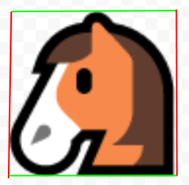
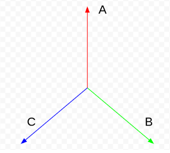
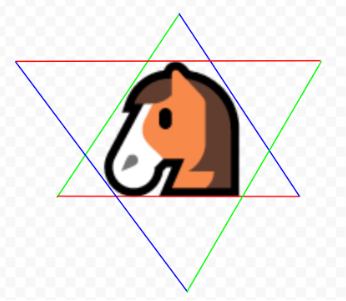
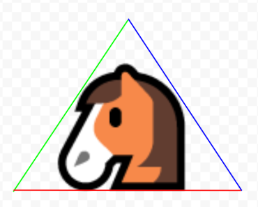
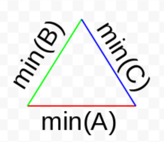
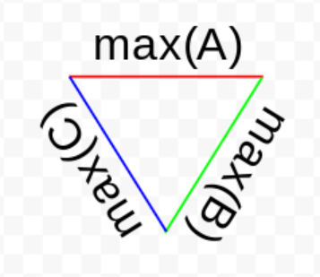
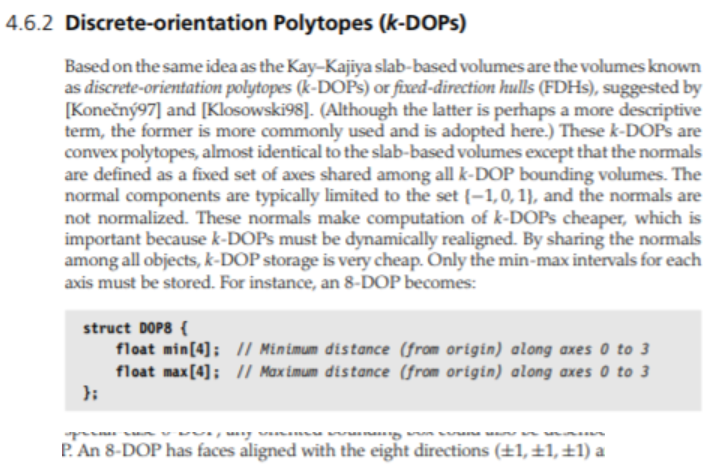

Axis-Aligned Bounding Dual Simplex
==================================

```
In computer graphics and computational geometry, a bounding volume for a set of objects is a closed volume that completely contains the union of the objects in the set. Bounding volumes are used to improve the efficiency of geometrical operations by using simple volumes to contain more complex objects. Normally, simpler volumes have simpler ways to test for overlap.
```

The axis-aligned bounding box and bounding sphere are considered to be the simplest bounding volumes, and therefore are ubiquitous in realtime and large-scale applications.

There is a simpler bounding volume unknown to industry and literature. By virtue of this simplicity it has nice properties, such as high performance in space and time. It is the Axis-Aligned Bounding Simplex.

Simplex
-------

In two dimensions a simplex is a triangle, and in three it is a tetrahedron. Generally speaking, a simplex is the fewest half-spaces necessary to enclose space: one more than the number of dimensions, or N+1. By contrast, a bounding box is 2N half-spaces.

In three dimensions a simplex has four (3+1) half-spaces and a bounding box has six (3*2). That’s 50% more work in order to determine intersection.

Axis-Aligned Bounding Triangle
------------------------------

We will work in two dimensions first, since it is simpler and extends trivially to three dimensions and beyond.

In two dimensions, a simplex is a triangle. The following are data structures for an axis-aligned bounding box and axis-aligned bounding triangle in two dimensions:

```
struct AABB { float minX, minY, maxX, maxY; };
struct AABT { float minA, minB, minC; };
```

2D AABB is well-understood. Here is an example of an object and its 2D AABB, where X bounds are red and Y are green:



2D AABT (axis-aligned bounding triangle) is not as well known. It does not use the X and Y axes - it uses the three axes ABC, which could have the values [X, Y, -X-Y], but for simplicity’s sake let’s say they are at 120 degree angles to each other:



The points from the horse image above can each be projected onto the ABC axes, and the minimum and maximum values for A, B, and C can be found, just as with AABB and XY:



Interestingly, however, it is possible to perform an intersection test without looking at both the min and max values, unlike with AABB. Because (minA, minB, minC) form a triangle, we can trivially reject against those three values in isolation, without considering (maxA, maxB, maxC):



That is why the data structure for an axis-aligned bounding triangle requires only (minA, minB, minC): it is sufficient to perform trivial intersection rejection tests:



To perform a trivial rejection against a group of (minA, minB, minC) target objects, your probe object would need to have the form (maxA, maxB, maxC):



And for each rejection test, if the probe’s maxA < the object’s minA (or B or C), they do not intersect. This is true of the two above triangles: they do not intersect.

There is no need for each object to store a (maxA, maxB, maxC) in addition to a (minA, minB, minC) simply to do intersection tests - only the probe needs (maxA, maxB, maxC). So if we stop here, we have a novel bounding volume with roughly the same characteristics as AABB, but 25% cheaper in 2D and 33% cheaper in 3D than AABB.

But if both min and max are stored in each object, an axis-aligned bounding hexagon results: 
 
Axis-Aligned Bounding Hexagon
-----------------------------

The axis-aligned bounding hexagon has six scalars, which makes it 50% bigger than an axis-aligned bounding box: 

```
struct AABB { float minX, minY, maxX, maxY; }; // bounding box
struct AABT { float A, B, C; }; // bounding triangle
struct AABH { AABT minABC, maxABC; }; // bounding hexagon
```

However, the hexagon has the nice property that it is made of two independent axis-aligned bounding triangles (minABC and maxABC), and unless two hexagons are nearly overlapping, a check of one hexagon’s minABC triangle vs the other’s maxABC triangle (or vice versa) is sufficient for trivial intersection rejection. 

Therefore, If the minABC is stored in one cacheline and the maxABC is stored in another cacheline, a bounding hexagon check is usually as cheap as a bounding triangle check:

A cheap axis-aligned bounding triangle test against minABC can be done first, and only in the unlikely event that an intersection test passes, a subsequent test against maxABC can be done if so desired. In this way, AABH has a larger memory footprint than AABB, but uses less memory bandwidth and computation than AABB.

Axis-Aligned Bounding Octahedron
--------------------------------

Everything above extends trivially to three and higher dimensions. In three dimensions, an axis-aligned bounding box, axis-aligned bounding tetrahedron, and axis-aligned bounding octahedron have the following structure:

```
struct AABB { float minX, minY, minZ, maxX, maxY, maxZ; }; // bounding box
struct AABT { float A, B, C, D; }; // bounding tetrahedron
struct AABO { AABT minABCD, maxABCD; }; // bounding octahedron
```

This makes AABO use 33% more memory than AABB, but since only the one of the two tetrahedra need be checked for initial trivial rejection, in practice a 3D AABO check is 4 scalars, and a 3D AABB check is 6. So, AABO uses 33% less bandwidth and computation than AABB.

Comparison to k-DOP
-------------------

Christer Ericson’s book “Real-Time Collision Detection” has the following to say about k-DOP, whose DOP8 is similar to Axis Aligned Bounding Octahedron:



k-DOP is different from the ideas in this paper, in the following ways:

* An Axis-Aligned Bounding Simplex does not have opposing planes, so it is not a k-DOP
* A k-DOP does not have dual polyhedra if there exists a hemisphere that contains none of its axes. A 6DOP always has a hemisphere that contains no axes, and so there can not be dual polyhedra in a 6DOP. Nowhere can we find discussion of how choice of axes affects a k-DOP’s ability to have dual polyhedra (one of which can be used for a trivial rejection or acceptance test, in isolation.)
* k-DOP is about opposing planes, and AABO is about opposing pairs of bounding polyhedra. a 6DOP doesn’t have opposing polyhedra - it has only one rectangular solid - but still qualifies as a k-DOP. An 8DOP can have opposing tetrahedra, but nowhere in literature can we find anyone mentioning this or making use of it, despite its large performance advantage.
* The minABCD and maxABCD of an AABO are each an independent bounding tetrahedron, and can perform trivial rejection by pairing with the opposite tetrahedron of another AABO, or trivial acceptance by pairing with the same tetrahedron of another AABO. In the typical case of small objects in a large world, this generally halves the energy spent in trivial rejection and acceptance. In the unlikely case of large objects in a small world, it offers no advantage.
* k-DOP has faces aligned with [+-1,+-1,+-1] but AABT (triangle or tetrahedron) have axes that point at the vertices of a simplex

Comparison To Bounding Sphere
-----------------------------

A bounding sphere has four scalar values - the same as an Axis Aligned Bounding Tetrahedron:

```
struct AABB { float minX, minY, minZ, maxX, maxY, maxZ; }; // bounding box
struct AABT { float A, B, C, D; }; // bounding tetrahedron
struct BS { float x, y, z, radius; }; // bounding sphere
```

In terms of storage a sphere can be just as efficient as a tetrahedron, but a sphere-sphere check is inherently more expensive, as it requires multiplication and its expression has a deeper dependency graph than an AABB or AABT check.

If the data are stored in very low precision such as uint8_t, the sphere-sphere check will overflow the data precision while performing its calculation, which necessitates expansion to a wider precision before performing the check.

AABB has no such problem, and neither does AABT (triangle or tetrahedron.) Their runtime check requires only comparisons, which can be performed by individual machine instructions in a variety of data precisions.

A bounding sphere can have exactly one shape, but each AABO can be wide and flat, or tall and skinny, or roughly spherical, etc. So, in comparison to an AABO, a bounding sphere may not have very tight bounds. 

