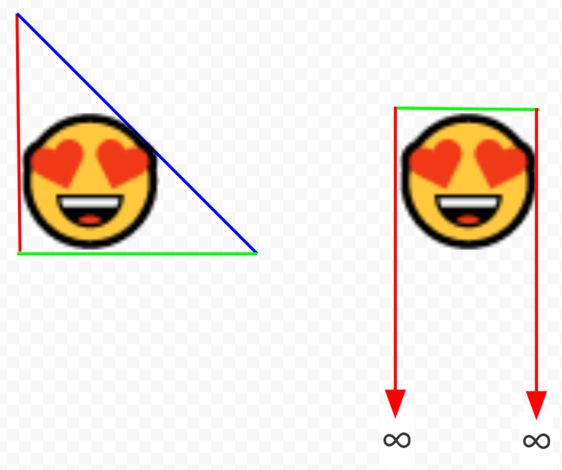

```
       Bounding Volume |   partial |   partial | accepts | seconds
                       |   accepts |   accepts |         |        
------------------------------------------------------------------
          AABB MIN,MAX |         0 | 152349412 |   39229 | 4.8294
            AABB X,Y,Z |  34310232 |   1154457 |   39229 | 4.1507
          7-Sided AABB |         0 |    172382 |   39229 | 3.0046
                  AABO |         0 |     67752 |   33793 | 2.1660
               Simplex |         0 |         0 |   67752 | 0.3200
```

Axis-Aligned Bounding Octahedra and The 7-Sided AABB
=========================================================

>In computer graphics and computational geometry, a bounding volume for a set of objects is a closed 
>volume that completely contains the union of the objects in the set. Bounding volumes are used to 
>improve the efficiency of geometrical operations by using simple volumes to contain more complex objects. 
>Normally, simpler volumes have simpler ways to test for overlap.

The axis-aligned bounding box and bounding sphere are considered to be the simplest bounding volumes, and therefore are ubiquitous in realtime and large-scale applications.

There is a simpler bounding volume unknown to industry and literature. By virtue of this simplicity it has nice properties, such as high performance in space and time. It is the Axis-Aligned Bounding Simplex.

Half-Space
----------

In 3D, a closed half-space is a plane plus all of the space on one side of the plane. A bounding box is the intersection of six half-spaces, and a bounding tetrahedron is the intersection of four. 

Simplex
-------

In two dimensions a simplex is a triangle, and in three it is a tetrahedron. Generally speaking, a simplex is the fewest half-spaces necessary to enclose space: one more than the number of dimensions, or N+1. By contrast, a bounding box is 2N half-spaces.

In three dimensions a simplex has four (3+1) half-spaces and a bounding box has six (3*2). That’s 50% more work in order to determine intersection.

Axis-Aligned Bounding Triangle
------------------------------

We will work in two dimensions first, since it is simpler and extends trivially to three dimensions and beyond.

In two dimensions, a simplex is a triangle. The following are data structures for an axis-aligned bounding box and axis-aligned bounding triangle in two dimensions:

```
struct Box
{ 
  float minX, minY, maxX, maxY; 
}; 

struct Triangle
{ 
  float A, B, C; 
}; 
```

2D AABB is well-understood. Here is an example of an object and its 2D AABB, where X bounds are red and Y are green:


Axis-aligned bounding triangle is not as well known. It does not use the X and Y axes - it uses the three axes ABC, which could have the values {X, Y, -(X+Y)}, but for simplicity’s sake let’s say they are at 120 degree angles to each other:


The points from the horse image above can each be projected onto the ABC axes, and the minimum and maximum values for A, B, and C can be found, just as with AABB and XY:


Interestingly, however, it is possible to perform an intersection test without looking at both the min and max values, unlike with AABB. Because {minA, minB, minC} define a triangle, we can trivially reject against those three values in isolation, without considering {maxA, maxB, maxC}:


That is why the data structure for an axis-aligned bounding triangle requires only (minA, minB, minC): in 2D, three values are sufficient to perform trivial intersection rejection tests:


To perform intersection tests against a group of {minA, minB, minC} target objects, your query object would need to have the form {maxA, maxB, maxC}:

```
struct UpTriangle
{ 
  float minA, minB, minC;
}; 

struct DownTriangle
{ 
  float maxA, maxB, maxC;
}; 
```


And for each test, if the query’s maxA < the object’s minA (or B or C), they do not intersect. This is true of the two above triangles: they do not intersect. 

```
bool Intersects(UpTriangle u, DownTriangle d)
{
  return (u.minA <= d.maxA) 
      && (u.minB <= d.maxB) 
      && (u.minC <= d.maxC);
}
```

There is no need to store a {maxA, maxB, maxC} in addition to a {minA, minB, minC} simply to do intersection tests - only the query needs {maxA, maxB, maxC}. If we stop here, we have a novel bounding volume with roughly the same characteristics as AABB, but 25% cheaper in 2D and 33% cheaper in 3D than AABB. If your only concern is determining proximity and you don't care if it's a little rough, this is probably the best you can do.

```
struct Triangles
{
  UpTriangle *up; // triangles that point up
};

DownTriangle query; // a triangle that points down, to compare against
```

But, if both {minA, minB, minC} and {maxA, maxB, maxC} *are* stored, their intersection is an axis-aligned bounding hexagon: 


Axis-Aligned Bounding Hexagons
------------------------------

The axis-aligned bounding hexagon has six half-spaces, which makes it 50% bigger than a 2D AABB with four half-spaces: 

```
struct Box
{ 
  float minX, minY, maxX, maxY; 
}; 

struct UpTriangle
{ 
  float minA, minB, minC;
}; 

struct DownTriangle
{ 
  float maxA, maxB, maxC;
}; 

struct Hexagons 
{ 
  UpTriangle   *up;   // triangles that point up, one per hexagon
  DownTriangle *down; // triangles that point down, one per hexagon
};
```

However, the hexagon has the nice property that it is made of two independent axis-aligned bounding triangles (minABC and maxABC), and unless two hexagons are nearly overlapping, a check of one hexagon’s minABC triangle vs the other’s maxABC triangle (or vice versa) is sufficient for initial trivial intersection rejection. 

Therefore, If the minABC triangles are stored separately from the maxABC triangles (as above,) a bounding hexagon check is usually as cheap as a bounding triangle check, since the second triangle is rarely visited.

```
bool Intersects(Hexagons world, int index, Hexagon query)
{
  return Intersects(world.up[index], query.down) 
      && Intersects(query.up, world.down[index]); // this rarely executes
}
```

No three of a 2D AABB's four half-spaces describe a closed shape. If you were to try to do an intersection check with less than four of an AABB's half-spaces, the shape would have infinite area. This is larger than the finite area of an hexagon's first triangle. That is the essential advantage of the hexagon.

For example, {minX, minY, maxX} is not a closed shape - it is unbounded in the direction of +Y. The same is true of any three of a 2D AABB's four half-spaces. The {minA, minB, minC} of a hexagon, however, is always an equilateral triangle, which is a closed shape.

A hexagon has a larger memory footprint than an AABB, but (usually) uses less memory bandwidth and computation than AABB.

Axis-Aligned Bounding Octahedra
-------------------------------

Everything above extends trivially to three and higher dimensions. In three dimensions, an axis-aligned bounding box, axis-aligned bounding tetrahedron, and axis-aligned bounding octahedron have the following structure:

```
struct Box
{ 
  float minX, minY, minZ, maxX, maxY, maxZ; 
}; 

struct UpTetrahedron
{ 
  float minA, minB, minC, minD;
}; 

struct DownTetrahedron
{ 
  float maxA, maxB, maxC, maxD;
}; 

struct Octahedra
{ 
  UpTetrahedron   *up;   // tetrahedra that point up, one per octahedron
  DownTetrahedron *down; // tetrahedra that point down, one per octahedron
};
```

*AABO uses 33% more memory than AABB, but since only one of the two tetrahedra need be read usually, an AABO check is usually four comparisons, while a 3D AABB check is six. AABO uses 33% less bandwidth and computation than AABB, and has 33% more half-spaces than AABB, for making tighter bounding shapes.*

Comparison to k-DOP
-------------------

Christer Ericson’s book “Real-Time Collision Detection” has the following to say about k-DOP, whose 8-DOP is similar to Axis Aligned Bounding Octahedron:


k-DOP is different from the ideas in this paper, in the following ways:

* An Axis-Aligned Bounding Simplex does not have opposing half-spaces, so it is not a k-DOP; there is no such thing as a 4-DOP in 3D.
* k-DOP is about opposing half-spaces, and AABO is about opposing bounding polyhedra. a 6-DOP doesn’t have opposing polyhedra - it has one rectangular solid - but still qualifies as a k-DOP. An 8-DOP *can* have opposing tetrahedra, but nowhere in literature can we find anyone mentioning this or making use of it, despite its large performance advantage.
* A k-DOP can not have opposing polyhedra if all of its axes point into the same hemisphere. Almost always in literature, k-DOP axes have non-negative X,Y,Z values where possible, which makes them point into the same hemisphere. Nowhere can we find discussion of how axis direction affects a k-DOP’s ability to have opposing polyhedra, which is required to avoid reading
half of its data most of the time. 
* For example, an 8-DOP likely has the axes [(1,0,1), (-1,0,1), (0,1,1), (0,-1,1)] which all point in +Z, and therefore
the same hemisphere. This can not be an AABO: it does not form opposing polyhedra.
* AABO is necessarily SOA (structure-of-arrays) to avoid reading the maxABCD tetrahedron into memory unless it's needed, and 8-DOP is AOS (array-of-structures) in all known implementations.  
```
struct Octahedra
{ 
  UpTetrahedron   *up;   // in different cacheline than
  DownTetrahedron *down; // this
};

struct DOP8
{
  float min[4]; // not a tetrahedron, in same cacheline as
  float max[4]; // this, which isn't a tetrahedron.
};
```

Comparison To Bounding Sphere
-----------------------------

A bounding sphere has four scalar values - the same as an Axis Aligned Bounding Tetrahedron:

```
struct Tetrahedron
{ 
  float A, B, C, D; 
}; 

struct Sphere
{
  float X, Y, Z, radius;
};
```

In terms of storage a sphere can be just as efficient as a tetrahedron, but a sphere-sphere check is inherently more expensive, as it requires multiplication and its expression has a deeper dependency graph than a polyhedron check.

If the data are stored in very low precision such as uint8_t, the sphere-sphere check will overflow the data precision while performing its calculation, which necessitates expansion to a wider precision before performing the check.

Polyhedra have no such problem. Their runtime check requires only comparisons, which can be performed by individual machine instructions in a variety of data precisions.

A bounding sphere can have exactly one shape, but each AABO can be wide and flat, or tall and skinny, or roughly spherical, etc. So, in comparison to an AABO, a bounding sphere may not have very tight bounds. 

The Pragmatic Axes
------------------

Though axes ABC that point at the vertices of an equilateral triangle are elegant and unbiased:


Transforming between ABC and XY coordinates is costly, and can be avoided by choosing these more pragmatic axes:

```
A=X
B=Y
C=-(X+Y)
```


The pragmatic axes look worse, and are worse, but still make triangles that enclose objects pretty well. With these axes, it is possible to construct a hexagon from a pre-existing AABB, that has exactly the same shape as the AABB, and where the final half-space check is unnecessary:

```
{minX, minY, -(maxX + maxY)}
{maxX, maxY, -(minX + minY)}
```


This hexagon won't trivially reject any more objects than the original AABB, but the hexagon will take less time to reject objects, because there are (usually) 3 checks instead of 4. 

At first, the three half-spaces of a triangle are checked, and only if that check passes, two more half-spaces are checked. The
intersection of the five half-spaces is identical to the four half-spaces of a bounding box, but in most cases, only the first
three half-spaces will be checked.


*In 3D the above needs 7 half-spaces, and is equivalent to a 3D AABB. In all tests I made, this 7-Sided AABB outperforms
the 6-Sided AABB. The 7th half-space - the diagonal one - serves no purpose, other than to prevent maxX, maxY, and maxZ from being read into memory. Once they are read into memory, it becomes superfluous, as above.*

If you construct the hexagon from the object's vertices instead, you can trivially reject more objects than an AABB can:

```
{minX, minY, -max(X+Y)}
{maxX, maxY, -min(X+Y)}
```


If it's unclear how a hexagon is superior to AABB when doing a 3 check initial trivial rejection test, the image below may help to 
explain. Even if you were to do 3 checks first with an AABB, no matter which 3 of the 4 checks you pick, the resulting shape is not closed. It fails to exclude an infinite area from the rejection test. 


